# Shared UI verification

## Change

Keep Save and Lock reachable on mobile, use visible keyboard focus, and verify the regenerated embedded bundle in CI. Shared assets are pinned to ky-ui 0.2.0 with content hashes. Product layouts, saved theme keys and named presets remain local.

## Capture conditions

Captured 2026-09-25 from this branch, using the application UI (not a design mockup). Real scratch server, encrypted preview workspace and a synthetic note opened in the lazy-loaded BlockNote editor.

OS-following Busnes Light and Dark were captured at 1280×900 and 390×844 CSS pixels. Browser device scaling may make PNG dimensions larger. Document width stayed within the viewport in these captured states; local navigation/table scrolling is intentional. Screenshots show the selected-page accent, not a complete accessibility audit.

No complete end-to-end product workflow or exhaustive named-theme audit is claimed.

## Checks

26 frontend tests, production build, go test ./internal/web and embedded-bundle comparison passed. Central ky-ui sync --check verified all ten consumers. Screenshot coverage is Busnes Light/Dark; existing named choices are retained, but not every named palette/page combination was visually exercised.

## Screenshots

| Light | Dark |
| --- | --- |
| 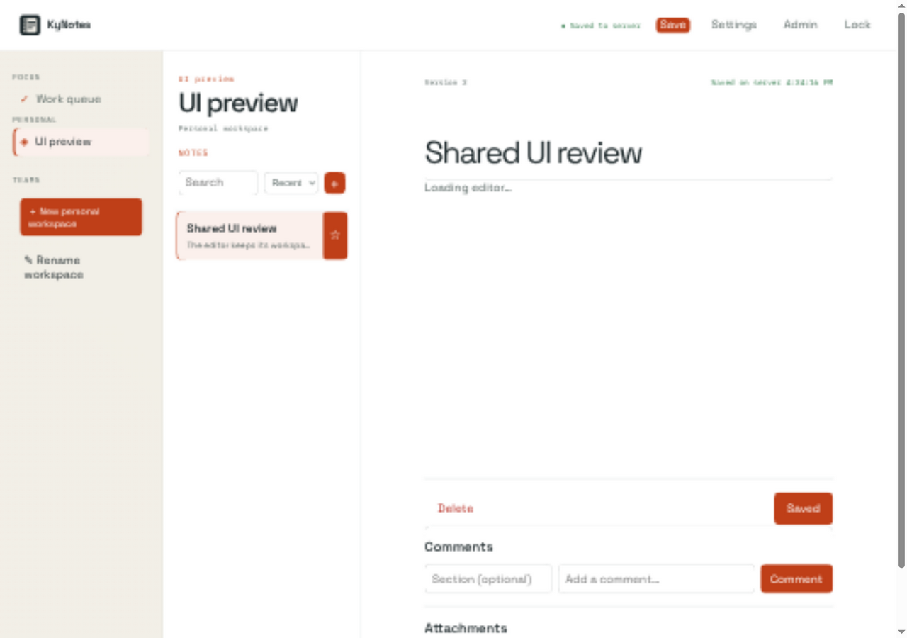 | 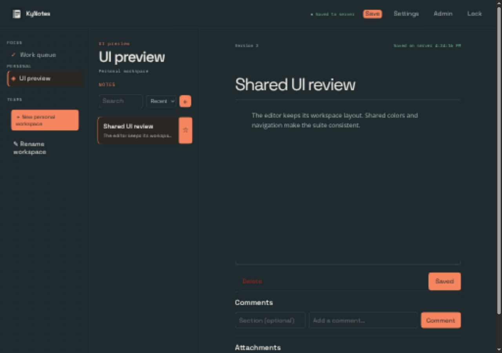 |
| 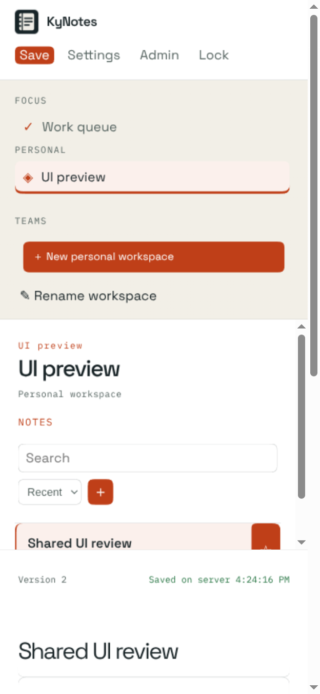 | 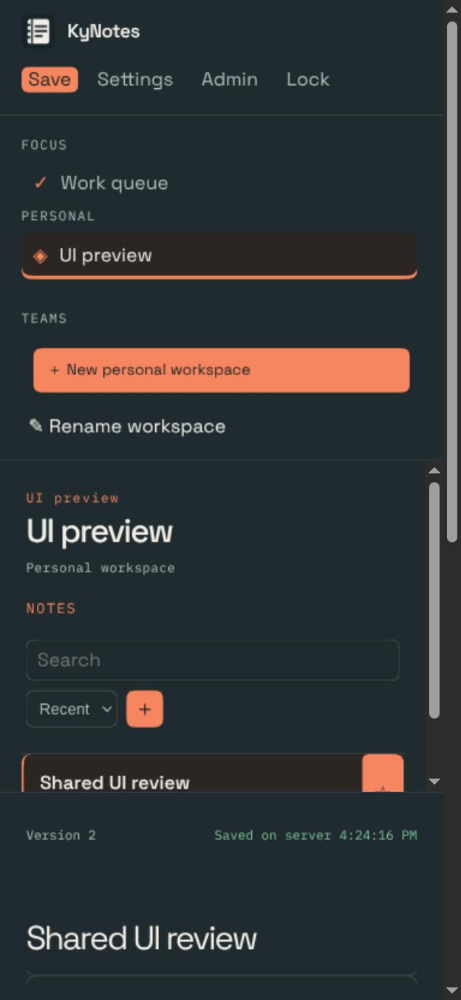 |

## Reproduce

Run npm ci, npm test (where configured), and npm run build in web/, then start the product with isolated local preview data following its README. Use System theme, emulate OS light/dark, and inspect both viewport sizes. Do not point preview instances at production data. For KyVault, use a configured development KyIdentity or explicitly labeled read-only browser fixtures; never bypass backend authentication.

## OneNote navigation (2026-10-06)

### Capture conditions

Scratch server on 127.0.0.1 with throwaway data (notebooks "Project Atlas" and "Home"), embedded bundle, Playwright Chromium. OS-following Busnes Light and Dark at 1280×900 and 390×844. The initial run found accent-filled section tabs, a stale page list row after editing, and an unthemed move select; they were fixed in 726a354 and re-verified on the new bundle.

### Results

| Check | Result |
| --- | --- |
| Create notebooks, sections, colors, pages; persist on reload | Pass |
| Reorder pages by drag and Alt+↑/↓; move by dropping on a tab and by the "Move page to section" select; order and placement persist after reload | Pass |
| Edit a page, switch pages within 1 s, reload: edit survives | Pass |
| Offline edit, switch page, drag to another section, back online, reload: edit present in the target section | Pass |
| Delete a section: its pages appear under Quick Notes, also after reload | Pass |
| Deep links in a new tab, Back/Forward one step each, garbage hash opens the first notebook with one changes request | Pass |
| Section ⋯ menu opens at the button, closes after actions and on Esc | Pass (light and dark, re-verified) |
| Search lists a page from another section with its section label | Pass |
| 390px: tab list scrolls horizontally, document width 375 px | Pass |
| Dark theme: selected tab distinguishable from unselected, ⋯ and ＋ transparent | Pass after fix (initial run: fail) |
| Open page's list row title and preview update without reload | Pass after fix (initial run: fail) |

Not run: none of the listed checks were skipped.

### Save path

Hard reload at the start, none between edit and move. Moves ran Planning to Research in round 1 and the reverse in round 2.

| Check | Result |
| --- | --- |
| Online edit, then move: row shows new title/body at once, no conflict text, persists after reload | Pass (both rounds) |
| Offline edit, reconnect, then move: saved after 20 s, no conflict text, persists | Pass (both rounds) |
| Move during autosave (move 0.2 s after typing): typed text persists in the new section | Pass (both rounds) |
| Rapid notebook switching Atlas, Home, Atlas, Home (150 ms): never shows Atlas pages under Home | Pass (both rounds) |
| Alt+↓ twice: focus stays on the moved row, order 1st to 3rd | Pass (both rounds) |
| Typing 200 characters with no delay: body exactly 200 characters after reload | Pass |
| Search, then open the result: editor shows the matching title and body | Pass |
| "Delete section" menu item is red | Pass |

### Conflict recovery

Two tabs: tab 2 offline (per-tab, via CDP) edits a page, tab 1 moves it to another section, tab 2 reconnects. The first save-path round found tab 2's edit lost. The conflict recovery runs found duplicate copies (three identical copies from one click, two from a double-click) and tab 2 staying on the old section. Fixed in b3c23d9..b39d823 and re-verified in round 2 after cleaning up the leftover copies.

| Check | Result |
| --- | --- |
| Banner "Another device saved this page first..." with a "Keep the other version as a copy" button | Pass |
| One click after several retries: one "(conflicting copy)" page directly after the original, in the original's section; original shows the server body; same after reloading both tabs | Pass after fix (initial run: fail) |
| Double-click (20 ms): exactly one copy | Pass after fix (initial run: fail) |
| Editor read-only during recovery (title readOnly, body not editable, keystrokes ignored), editable again afterwards | Pass |
| Tab 2 switches to the original's section after recovery | Pass after fix |

### Open items

- CSP `style-src 'self'` blocks inline styles from the app and BlockNote bundles, producing console errors and a BlockNote placeholder-CSS `insertRule` warning during editing. Not introduced by this branch; whether it predates it was not checked.
- Mobile layout is cramped: sidebar plus tabs take about 500 px and the page list and editor sit in nested scrollers below the fold. Pre-existing and unchanged.

No complete end-to-end product workflow or accessibility audit is claimed.

### Screenshots

| Light | Dark |
| --- | --- |
| 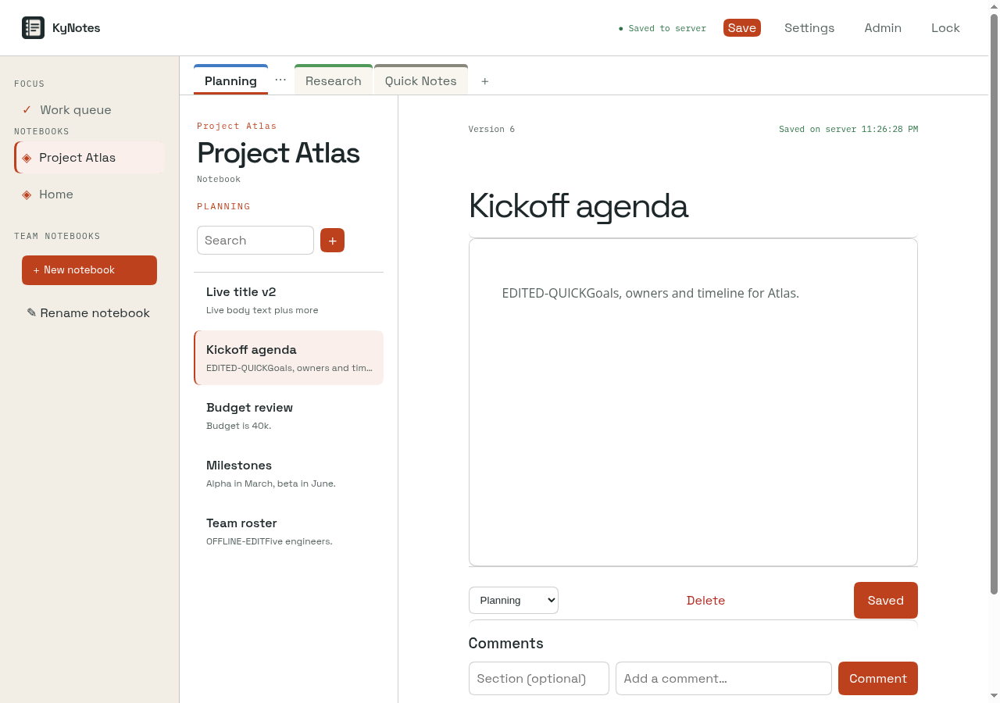 | 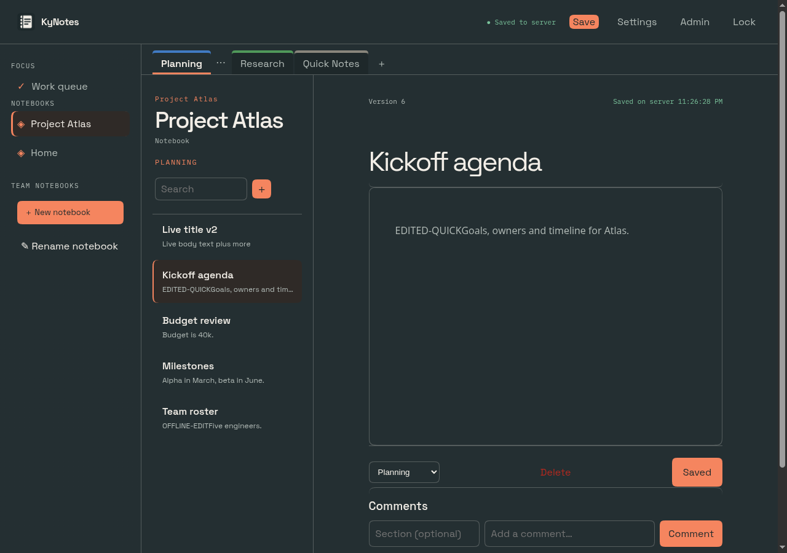 |
| 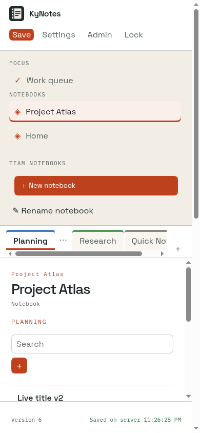 | 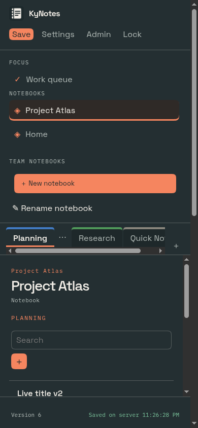 |
| 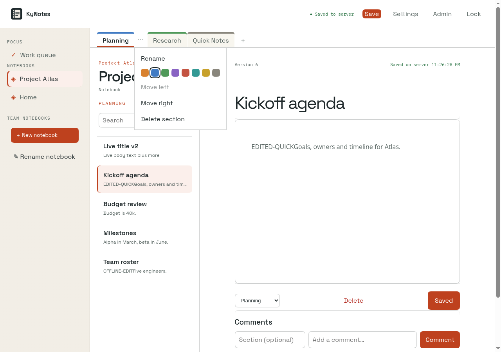 | 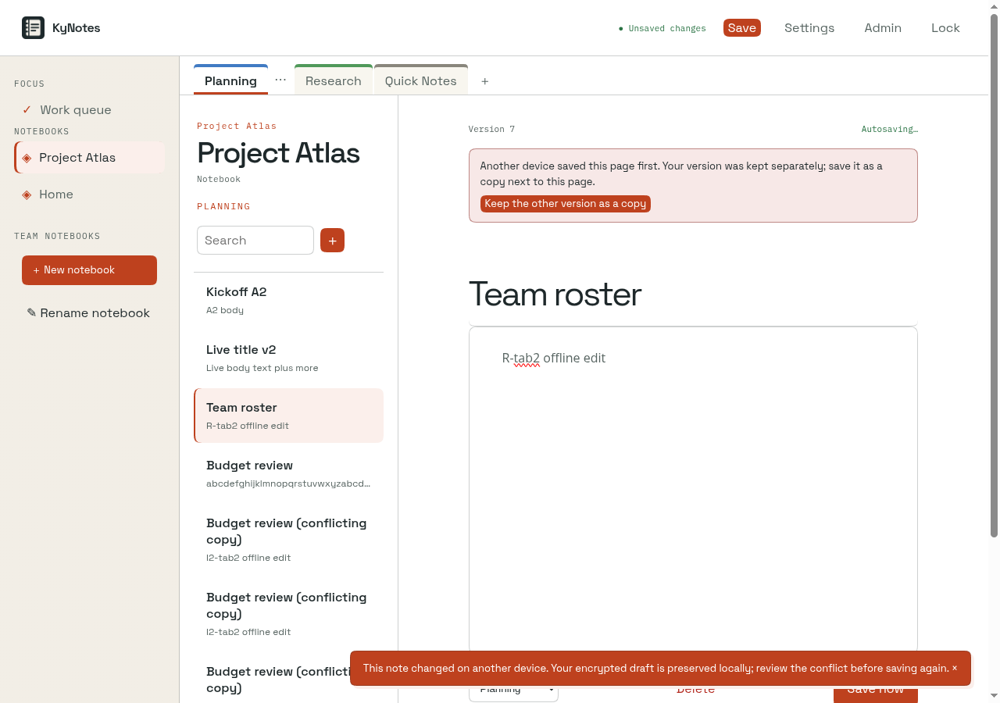 |
| 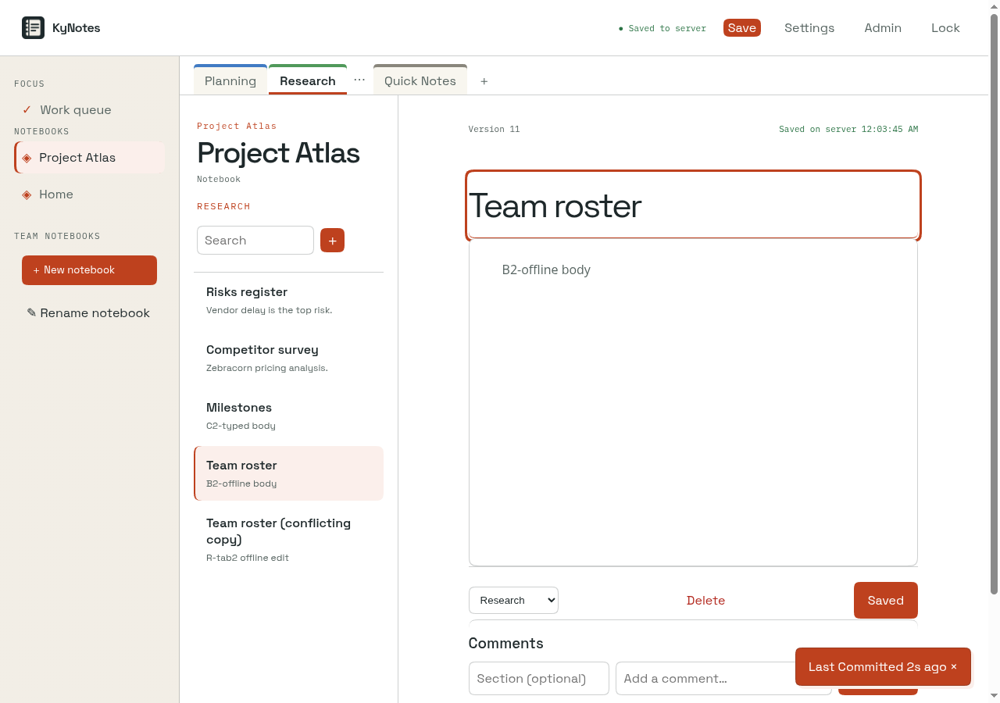 | |

## Canvas pages (2026-10-07)

Scratch server on copied preview data (never production), Playwright MCP, Chromium, 1280x900 in Busnes Light and Dark unless noted. Fixes landed in 3fc6b41..b43135f and the right-edge box fix in 18690ce.

| Check | Result |
| --- | --- |
| Legacy page opens as one box, no `PUT` on close | Pass. Caveat: copied legacy pages are plain paragraphs, so heading/list formatting is untested |
| Typing, two boxes, same positions after reload; empty box pruned | Pass. One empty box remained and was saved; since the final-review fixes an empty box is saved only by its first edit (not re-run in a browser) |
| Box drag, resize, arrow keys (Shift for larger steps) persist | Pass |
| Ink: colors, sizes, highlighter, undo/redo, eraser, persistence; undo history per page | Pass after fix (3fc6b41..b43135f: invisible toolbar pressed state and swatches, undo keys dead after mouse drawing) |
| Dark theme ink strokes are light | Pass |
| Image drop renders and survives reload | Pass after fix (20a5791: CSP `img-src` allows `blob:`) |
| Work queue lists a checklist item from a second box; only Work queue is selected in the sidebar | Pass (selection fixed in b43135f) |
| Touch 1024x768: Type-mode scroll creates no box, Pen-mode one finger draws | Pass |
| Phone 390x844: boxes stack in reading order, ink tools hidden, ink notice, "Add text" works | Pass |
| Editing a legacy page saves and keeps formatting | Pass (caveat as above) |
| Quick strokes are not truncated (10 back to back) | Pass; two early strokes truncated once, not reproduced |
| Legacy box narrowed to the canvas for display without a `PUT` | Pass |
| New box at the right edge stays inside the canvas | Fixed after verification (18690ce); not re-run in a browser |
| Undo keys ignored inside the step-up `<dialog>` | Fixed after verification (18690ce); not re-run in a browser |
| Ink and click-to-add reach below a long note (surface sized from measured box heights) | Fixed after verification (final-review fixes); not re-run in a browser |
| Editing on a phone keeps desktop box widths | Fixed after verification (final-review fixes); not re-run in a browser |
| Right-edge placement while scrolled horizontally lands at the click | Fixed after verification (final-review fixes, `fitBox` unit-tested); not re-run in a browser |
| Undo keys match the letter Z on Latin layouts (AZERTY, QWERTZ) and the physical Z key on non-Latin layouts | Fixed after verification (final-review fixes, `isUndoKey` unit-tested); not re-run in a browser |
| Page full: body near 9 MiB shows "page is full", no `PUT` | Not run in a browser; `pageFits` is unit-tested |
| Real stylus pressure | Unproven: no pen device |

### Open items

- BlockNote/Mantine inline styles still raise CSP `style-src 'self'` console errors on page load. Not introduced by this branch.
- Already-saved canvas boxes wider than the visible canvas are not narrowed; only legacy boxes are.

### Screenshots

| Light | Dark |
| --- | --- |
| 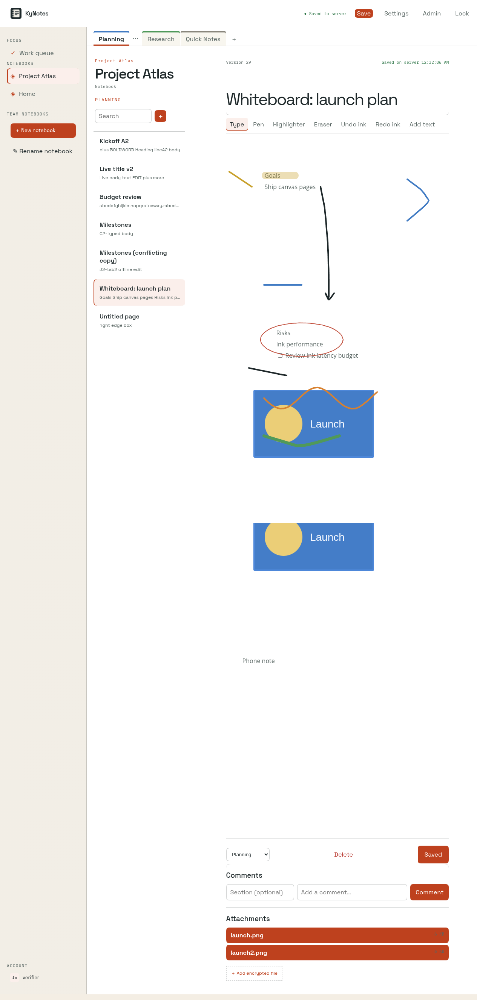 | 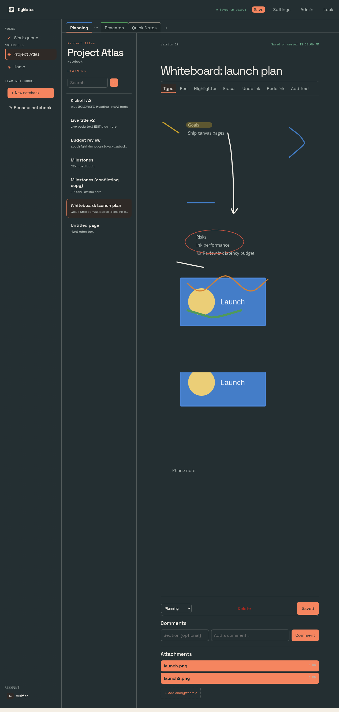 |
| 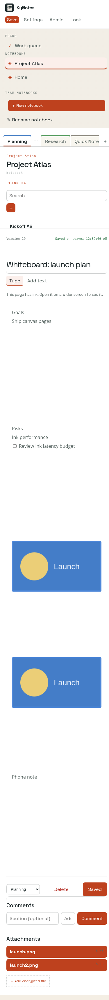 | 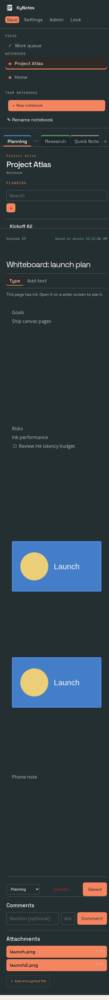 |
| 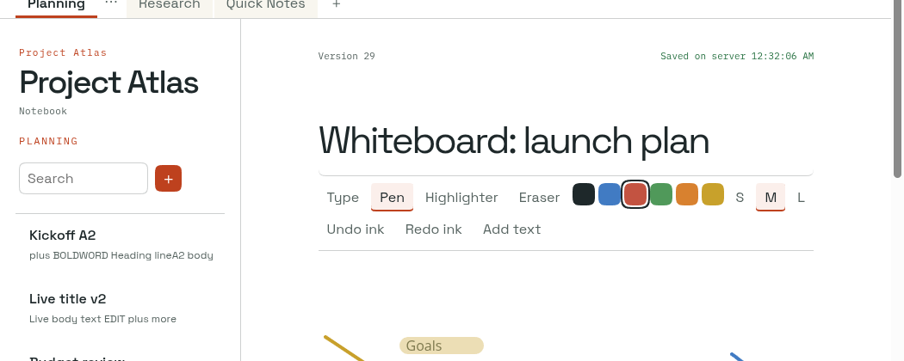 | 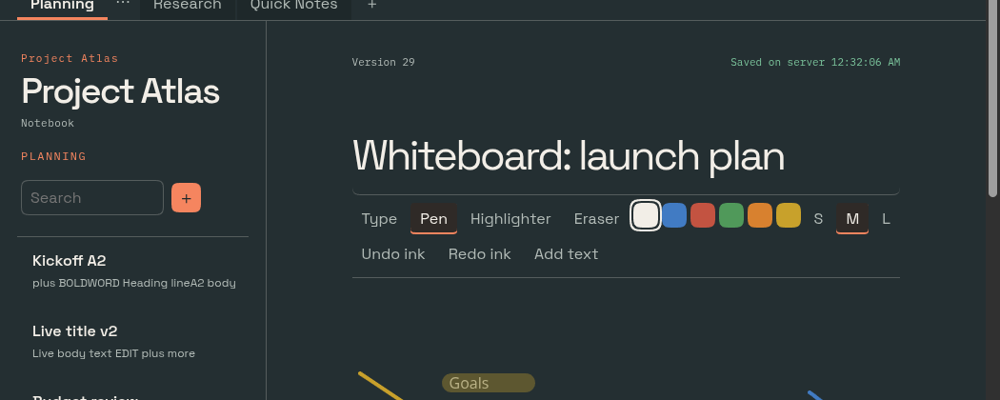 |

## Subpages and section groups (2026-10-07)

Scratch server with throwaway data (never production), Playwright MCP, Chromium, 1280x900 in Busnes Light unless noted. Tab drops in the first run used synthetic DragEvents; the re-verification used real mouse drags (`page.mouse` down, 15 move steps, up).

| Check | Result |
| --- | --- |
| Legacy page opened and left without typing sends no `PUT` | Pass |
| Indent/outdent with Ctrl+Alt+] / Ctrl+Alt+[ and the editor buttons; Tab only moves focus; levels persist after reload | Pass |
| Collapsing a parent hides its subpages; collapse persists after reload | Pass |
| Moving a parent by Alt+ArrowDown, by in-list drag and by tab drop carries its subpages, hidden ones included | Pass; tab drop confirmed with a real mouse drag in the re-verification |
| Deleting a parent keeps its subpages, one level up | Pass |
| Search opens a hidden subpage and expands its ancestors | Pass |
| Nested groups three deep, every breadcrumb step navigates, section dropped on a group tab moves in | Pass |
| Deleting a middle group moves its sections and groups up | Pass (success path only; the stop-on-failure path is not browser-tested) |
| Deep link to a page in a grouped section opens the right group and page in a new tab | Pass |
| Group without sections shows no pages and no editor | Pass |
| Phone 390x844 | Pass after fix: the editor action row overflowed (scrollWidth 579); fixed in 3c97104, re-verified at 375 in light and dark |
| Indent/Outdent buttons match the quiet Delete button, one line | Pass after fix (3c97104), re-verified light and dark, desktop and mobile |
| Dark theme: group tab, breadcrumb, indentation and toggles legible | Pass |
| Subpage level and collapsed state announced to screen readers | Fixed after verification (09a60d3, visually hidden row text); not re-run in a browser |
| Quick Notes orphans of a deleted section start at level 0 | Fixed after verification (09a60d3, `displayLevels` unit-tested); not re-run in a browser |
| Dropping a page on its own section's tab does not move it; group menus disabled while busy | Fixed after verification (09a60d3); not re-run in a browser |

### Open items

- Playwright `dragTo` from a row below the fold onto a section tab moved a neighbouring page. Diagnosed as a harness artifact: `dragTo` presses on the row, then scrolls the window back to bring the tab into view before the first move, so the drag starts on whichever row is now under the pointer. Real mouse drags moved the correct block.
- A second real drag back onto the "Sprint board" tab appeared not to move the block during re-verification. The final reviewer could not reproduce this with a real mouse drag on the same data. The most likely cause is an ambiguous text locator.
- BlockNote/Mantine inline styles still raise CSP `style-src 'self'` console errors on page open. Not introduced by this branch.

### Screenshots

| Light | Dark |
| --- | --- |
| 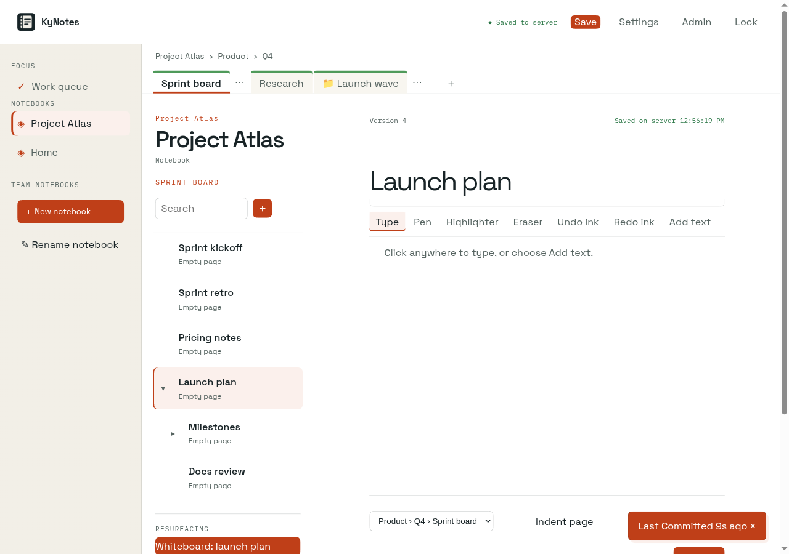 | 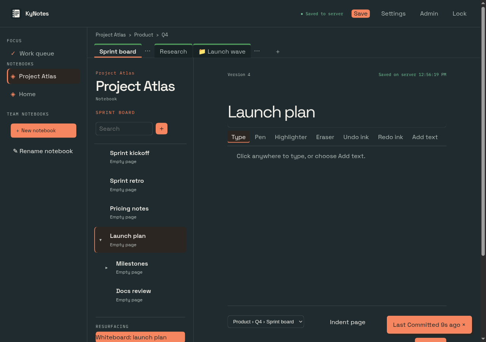 |
| 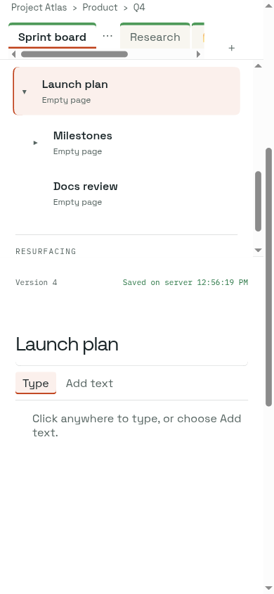 | 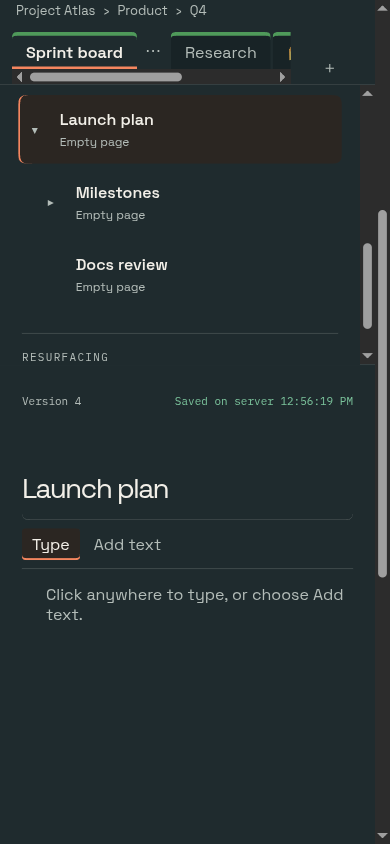 |
| 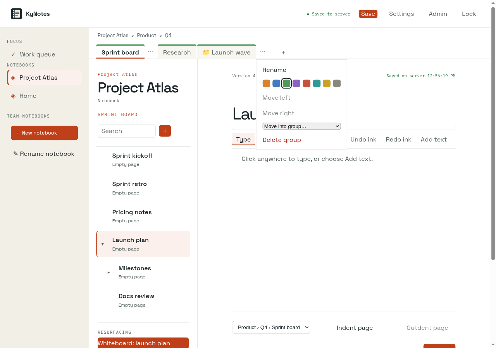 | |

## Team keys P3a (2026-10-07)

Scratch server from `web/e2e/server.sh` (fresh `/tmp` data, `127.0.0.1:18080`, never production), driven by a scratch Playwright library script, Chromium headless. Busnes Light and Dark follow the emulated OS scheme; no saved theme choice. Captured at 1280x900 and 390x844 CSS pixels, device scale 1, from the bundle embedded at this branch. State: an owner, a member who never signed in (blocked team), and a newcomer added after the first key and before any steward reopened the team.

| Check | Result |
| --- | --- |
| "Not end-to-end shared yet" notice renders in the notebook header | Pass in all four; wraps inside the list header, no document or element overflow |
| Key-wait line ("Waiting for a team owner…") renders in the notebook header; New page disabled | Pass in all four; no overflow |
| Settings shows the fingerprint in `<code>` inside its card at 390 px | Pass; wraps by group, stays inside the card, light and dark |

Overflow was measured in the page (`documentElement.scrollWidth` against the viewport, the element's own scroll width, and its box against the enclosing card or header), not judged by eye alone.

### Open items

- Key-wait now disables "Create a note" and every other change in the notebook (sections, groups, page moves and deletes, comments, attachments, conflict copies). The e2e checks New page and New section or group are disabled; the rest were not re-captured.
- The newcomer's waiting notebook shows the fallback label `Notebook <id>` until keys arrive, as designed: the name is sealed with the container key.

### Screenshots

| Light | Dark |
| --- | --- |
| 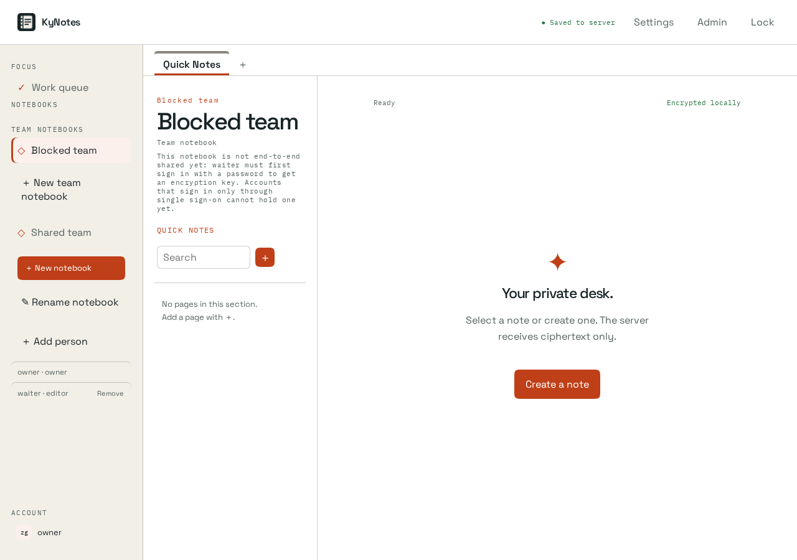 | 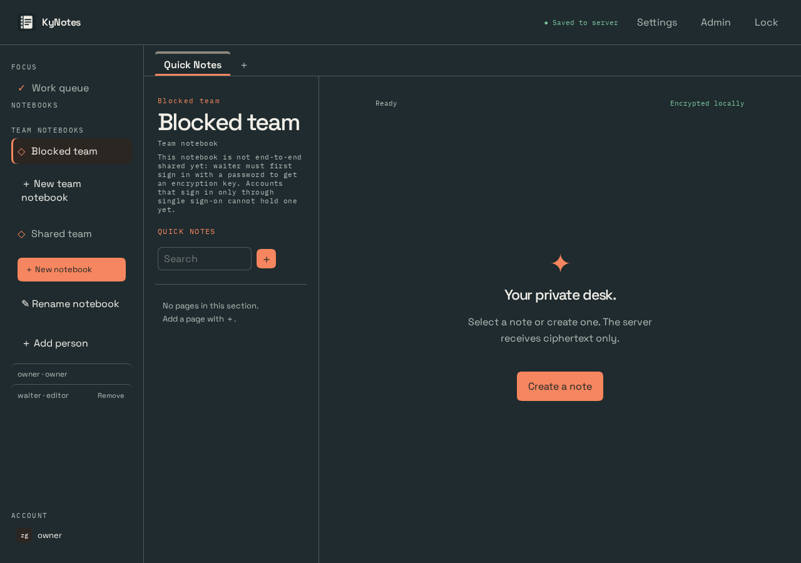 |
| 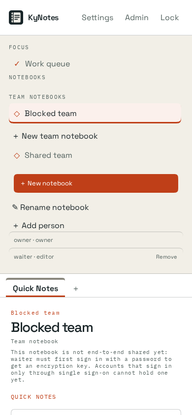 | 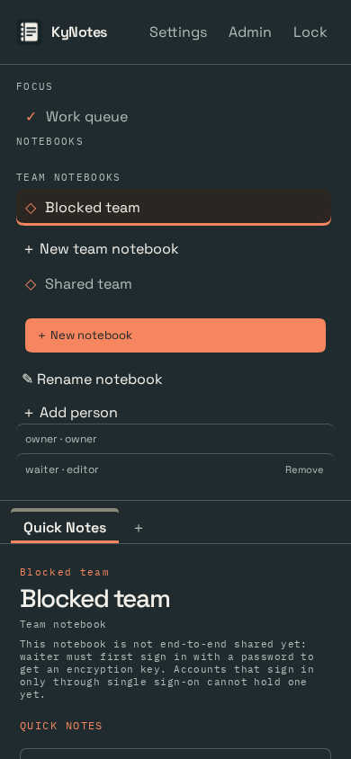 |
| 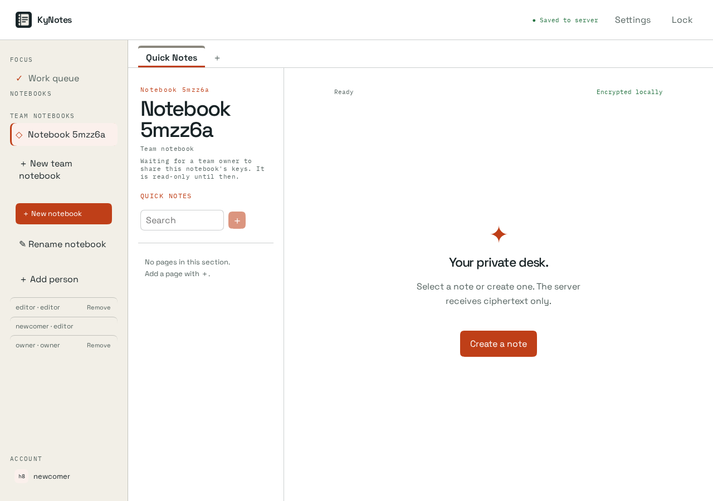 | 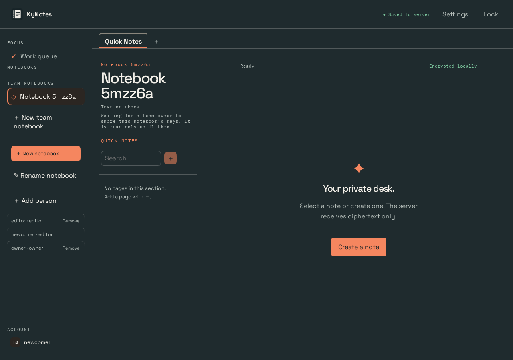 |
| 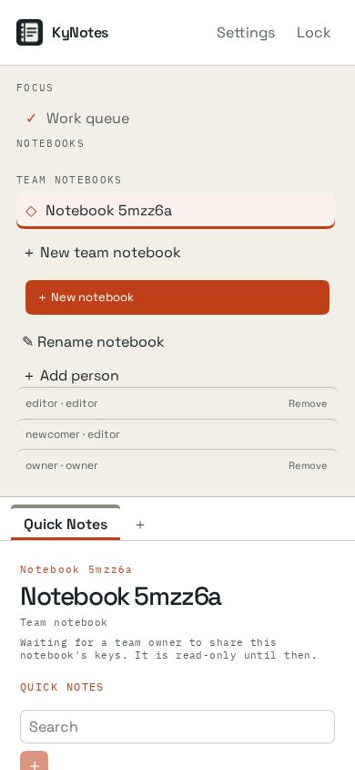 | 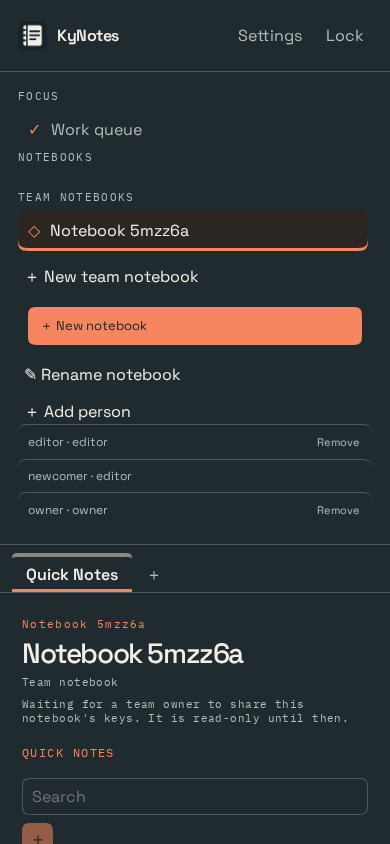 |
| 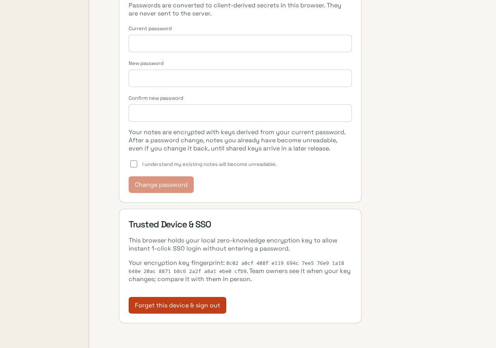 | 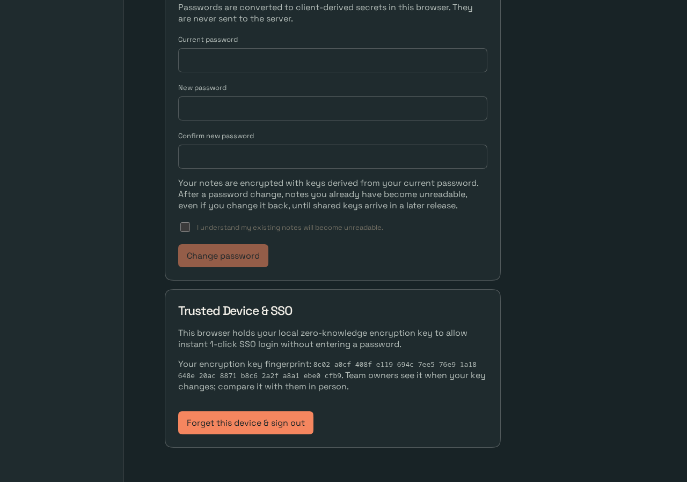 |
| 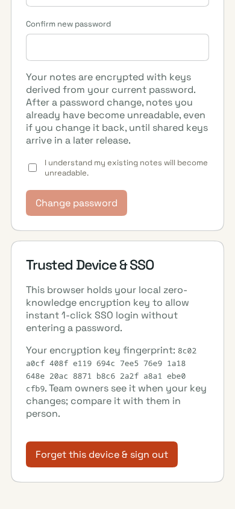 | 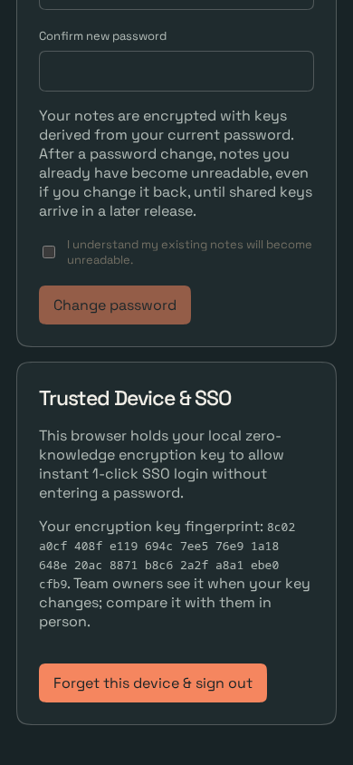 |

### Rendered labels and notices (P3a)

Superseded (team-keys spec §9, 2026-10-08): the login-key rows, their "Not verified" labels and the "not end-to-end shared yet" notice no longer exist; every notebook is keyed at creation. Kept as a record of that build.

Same scratch server and Chromium; two separate browser contexts (owner, member). Scripted states, none faked in the DOM: the owner creates a team with a member who never signed in and sees the "not end-to-end shared yet" notice; writes a parent page and an indented subpage under the legacy key; the member signs in with a password (identity created); the owner reopens, the first key is minted, and "Shared this notebook's name with members" and the "Not verified" labels render. A move of the legacy parent (Alt+ArrowDown with a verified sibling below) shows the subpage refusal. Busnes Light and Dark via emulated OS scheme, 1280x900 and 390x844, device scale 1. File pattern `docs/team-keys-p3a-label-<state>-<light|dark>-<desktop|mobile>.png`; the `page-label` mobile files are full-page, the `list-labels` files are mobile only with the page list scrolled to its end.

| State | Files | Result |
| --- | --- | --- |
| Unshared notice | `unshared-notice-*` | Pass; wraps in the list header, no horizontal overflow |
| Shared notice (fingerprint plus name shared) | `shared-notice-*` | Pass; wraps, no overflow |
| "Not verified" row labels, banner "Written before this notebook was shared; not end-to-end verified." | `page-label-*`, `list-labels-*-mobile` | Pass; legible in both themes. At 390 px the labelled rows sit below the fold of the 280 px page list (see below) |
| Subpage refusal toast | `move-refused-*` | Pass; text legible. On mobile it covers the notice text; on desktop it stacks over the commit toast |

Findings, not fixed here: at 390 px the notebook notice fills most of the 280 px `.note-list` (`web/src/styles.css:66`), so the labelled rows need an inner scroll to be seen; `.toast` (`web/src/styles.css:65`) is fixed at the same corner as `.commit-toast`, so an error toast overlaps it.

## Team keys P3b (2026-10-08)

Capture conditions: real Chromium (Playwright, headless) against the throwaway `web/e2e/server.sh` server (127.0.0.1:18080, fresh data directory, embedded bundle at the P3b head). Scratch scripts lived outside the repo. Four browser contexts (owner, editor, newcomer, plus a never-signed-in `ghost` account); nothing was set in the DOM. Each state was shot in Busnes Light and Dark (`emulateMedia` colorScheme) at 1280x900 and 390x844 as `docs/team-keys-p3b-<state>-<light|dark>-<desktop|mobile>.png`. Overflow was measured in the page (`documentElement.scrollWidth` and elements whose right edge passes the viewport).

| State | Files | Result |
| --- | --- | --- |
| Join banner, link opened in a fresh tab (address bar had no token; token held in sessionStorage) | `join-fresh-tab-*` | Pass; banner legible in both themes |
| Join banner, link pasted into an already-open tab (window object kept, no reload) | `join-open-tab-*` | Pass; same |
| Member rows: has key, waiting for key, no encryption key yet (editor's view) | `member-rows-*` | Legible; user IDs wrap mid-ID in the 210 px desktop sidebar |
| Waiting banner with "Ask an owner" (newcomer) | `ask-owner-*` | Pass; the control is a small quiet link |
| Settings: your user ID | `settings-user-id-*` | Desktop pass; 390 px clipped (see findings) |
| Colleague keys, ID-first name, "matches the server" | `colleague-keys-*` | Desktop pass; 390 px clipped |
| Colleague keys after the colleague's key changed, "Trust new key" | `colleague-keys-changed-*` | Desktop pass; 390 px clipped |
| Unsent edits: one owned entry, one sealed owner-unknown entry, export/discard, unencrypted-export warning | `unsent-edits-*` | Desktop pass, buttons touch; 390 px clipped |

Not captured as screenshots: the invite dialog (keys sealed / no keys, including the not-yet-signed-in "you cannot see this person's encryption key yet" copy), the Ask an owner text and the re-trust confirm are native `prompt`/`confirm` dialogs, which headless screenshots never contain. Their exact text and the copied value were read from the dialog events (user ID first, both fingerprints in the confirm). The "Unsent edit, owner unknown: N edit(s) ... sealed with a notebook key" variant was not produced; the entry shown is the "owner unknown, cannot be opened in this browser" variant (a row with empty owner and an undecryptable payload). The member-row key states were captured before the editor's reset; later shots show the editor as waiting.

Findings, not fixed here:

- Fixed after capture (`minmax(0, 1fr)` and a gap between Unsent edits buttons); re-measured with a fresh owner at 390x844 in both themes: Settings `scrollWidth` 390 = viewport (`docs/team-keys-p3b-settings-fixed-*-mobile.png`). The `*-mobile` shots above predate the fix. Original findings:
- At 390 px the non-admin Settings page was 523 px wide: the last `.settings-sidebar` link ("Colleague keys", added in P3b) makes the single `1fr` track at `web/src/styles.css:157` grow to the nav's width, so every card is clipped on the right and a light strip shows past the dark page. `minmax(0, 1fr)` would contain it.
- Export and Discard unsent edits touch each other (no horizontal gap, `web/src/styles.css:94`).
- User IDs (30 chars, no break points) wrap mid-ID in the 210 px sidebar member rows (`web/src/styles.css:149`); the last row sits flush against the ACCOUNT label.
- "Ask an owner" is an 11 px quiet link in the status line (`web/src/main.tsx:2481`); at 390 px the member list pushes it and the join banner about 700 px down the page.
- A member row whose username equals its role reads "usr_... · editor · editor · has key".

## Team keys P3c (2026-10-08)

Capture conditions: real Chromium (Playwright, headless) against the throwaway `web/e2e/server.sh` server (127.0.0.1:18080, fresh data directory, embedded bundle at the P3c head). Scratch scripts lived outside the repo. Contexts: the owner's browser (holds the key), a second browser of the owner's account whose vault identity was removed (as a single sign-on browser would not hold it), and an administrator-created account with no key whose `GET /api/v1/auth/session` answer was rewritten to `sso: true` (the only stub; nothing was set in the DOM). Each state was shot in Busnes Light and Dark (context `colorScheme`) at 1280x900 and 390x844 as `docs/team-keys-p3c-<state>-<light|dark>-<desktop|mobile>.png`, two animation frames after each resize. Overflow was measured in the page (`documentElement.scrollWidth` and elements whose right edge passes the viewport); the check code's line count is its `getClientRects().length`.

| State | Files | Result |
| --- | --- | --- |
| Workspace link banner ("This browser does not hold your encryption key", Link this browser) | `link-banner-*` | Pass; no overflow |
| Newcomer waiting, request code shown | `newcomer-waiting-*` | Pass |
| Approver "Link another browser" with one request row | `approver-request-*` | Pass |
| Newcomer with the check code, Codes match / Codes differ | `newcomer-check-code-*` | Pass; check code on one line at both widths |
| Approver with the newcomer's code typed, Approve — send key enabled / Codes differ | `approver-check-code-*` | Pass; buttons wrap at 390 px |
| SSO "Set up encryption key" banner | `sso-setup-*` | Pass |

Every state: `scrollWidth` equals the viewport. At 390 px the only elements past the right edge are Settings nav links inside `.settings-nav`, which scrolls horizontally by design (`overflow: auto`).

Not captured as screenshots: the Forget-this-device confirm is a native `confirm`; the e2e matches its full text. Real single sign-on (KySignOn step-up for an approve, SSO key set-up) needs a live IdP and was not driven; only the banner was rendered.

Findings, not fixed here:

- At 390 px "Codes differ" wraps under "Approve — send key" and sits 8 px right of it (`.config-card button + button { margin-left: 8px }` at `web/src/styles.css:95` adds to the `.link-actions` gap), so the two buttons do not align.
- The approver's check-code input is 23 px tall, below a comfortable touch target.
- The newcomer's Settings "Trusted Device & SSO" intro still says "This browser holds your local zero-knowledge encryption key" directly above "This browser holds no encryption key for team notebooks".

## Team keys P4 (2026-10-08)

Superseded (team-keys spec §9, 2026-10-08): the review dialog, closure, reopen and `/legacy` route below were removed with the legacy login-derived key. The `team-keys-p4-*` files show a build that no longer exists.

Capture conditions: real Chromium (Playwright, headless) against the throwaway `web/e2e/server.sh` server (127.0.0.1:18080, fresh data directory, embedded bundle at the P4 head). The captures come from the e2e itself: `KYNOTES_E2E_SHOTS=<absolute docs path> npm run e2e --prefix web` shoots each state at the moment the run reaches it, with the state scrolled into view. The only stubs are the malicious-server routes the e2e already uses (a page sealed with the editor's login key and labelled below sharing, and a `/legacy` answer of 500); nothing was set in the DOM. Each state was shot in Busnes Light and Dark (`emulateMedia` colorScheme) at 1280x900 and 390x844 as `docs/team-keys-p4-<state>-<light|dark>-<desktop|mobile>.png`, two animation frames after each resize. The run asserts `documentElement.scrollWidth` is at most the viewport width.

| State | Files | Result |
| --- | --- | --- |
| Editor's banner: 4 items not end-to-end verified, "Review and share…" and "Stop opening pre-sharing items"; the forged page listed with "Not verified" | `banner-*` | Pass; no overflow |
| Review dialog: four items (one long forged title), each labelled "Written before sharing; not end-to-end verified", nothing ticked, Share disabled | `dialog-*` | Pass; dialog 374 px right edge at 390 px, `overflow-y: auto`; four items fit without scrolling |
| Editor after sharing: closed line with "Show pre-sharing items again"; the forged page gone | `closed-*` | Pass |
| Owner after its automatic close: "3 items … can be opened only by their authors" | `others-*` | Pass |
| Second browser, `/legacy` answered 500: why the check failed, and Stop | `unchecked-*` | Pass |

Not captured as screenshots: the Share-and-hide, Stop and "Show pre-sharing items again" confirms are native `confirm` dialogs, which headless screenshots never contain; the e2e matches each one's full text. The dialog's internal scrolling was not exercised: four items fit at 390x844.

Findings, not fixed here:

- At 1280 px the banner sits in the 235 px list column: "Review and share…" is a small inline button while "Stop opening pre-sharing items" wraps to two lines below it, so the two actions differ in size and weight.
- "Show pre-sharing items again" is a quiet button in the small monospace status line and reads as plain text.

## Team keys P5 (2026-10-08)

Capture conditions: real Chromium (Playwright, headless) against the throwaway `web/e2e/server.sh` server (127.0.0.1:18080, fresh data directory, embedded bundle with the legacy key removed). The captures come from the e2e itself: `KYNOTES_E2E_SHOTS=<absolute docs path> npm run e2e --prefix web` shoots each state when the run reaches it, the named card scrolled into view, in Busnes Light and Dark (`emulateMedia` colorScheme) at 1280x900 and 390x844, two animation frames after each resize. Files: `docs/team-keys-p5-<state>-<light|dark>-<desktop|mobile>.png`. The run asserts `documentElement.scrollWidth` is at most the viewport width; every shot measured exactly the viewport. The codes shown belong to a throwaway server.

| State | Files | Result |
| --- | --- | --- |
| New personal notebook, keyed at creation, with its first page and the "Save a recovery code" banner | `keyed-*` | Pass; no "Not verified" label or review banner. At 390 px the commit toast covers the first page row |
| Recovery code shown once: intro, the code, keep/last warnings, Print, Download, I saved it | `recovery-code-*` | Pass; at 390 px the code wraps after its fourth group and "I saved it" wraps below Print and Download |
| Type-back: "Type group N of 7 from your saved copy", code hidden, Show the code again, Save recovery code | `recovery-type-back-*` | Pass |
| Fresh browser after an administrator reset: "Use a recovery code" beside "Link this browser" | `restore-*` | Pass; Restore disabled while the field is empty |
| Restored browser reading the team notebook | `restored-*` | Pass |
| Reset dialog: held-key status, the full loss list, Export unsent edits first, Type RESET, Your password, Cancel, Continue (disabled) | `reset-dialog-*` | Pass |
| The new code a reset shows | `reset-code-*` | Pass; same layout as `recovery-code-*` |

Not captured as screenshots: the "Notebook name" prompt and the administrator reset alert are native dialogs; the e2e matches each one's full text. Refusal states (typo, wrong code, a copy for another key, wrong reset password) are asserted by text, not shot.

Findings, not fixed here:

- After a successful restore, Settings shows "Linked. This browser now holds your encryption key." (`main.tsx` `justLinked`): the restore card and its "Restored. …" status unmount once the key is held, so the user reads link copy after a restore.
- The team member list shows "Add person" and "Remove" to members who are not stewards (the restored editor's `restored-*` shot). Present before P5; this run did not check what the server answers.
